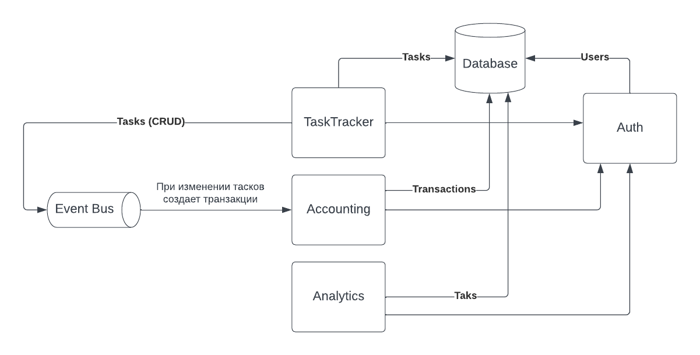

# Popug Task Tracker

Проект состоит из 4 сервисов:
* Сервис авторизации
* Таск трекер
* Аккаунтинг
* Аналитика

## Сервис авторизации

Остальные три сервиса используют синхронно этот сервис.

## Таск трекер

* Имеет веб интерфейс для работы с тасками.
* Создает события (Task.Create, Task.Assignee, Task.Close) в шину.

## Аккаунтинг

* Слушает шину событий и создает соответствующие транзакции
* В конце дня считает все транзакции по каждому юзеру и производит оплату
* Имеет дашборт для вывода разных данных из базы

## Аналитика

Спорный сервис, функционал которого вроде как можно положить в Аккаунтинг. Так как он просто смотрит в базу и:
* считает по транзакциям сколько заработала компания за день
* считает по транзакциям какие юзеры ушли в минус
* селектит самую дорогую таску за период