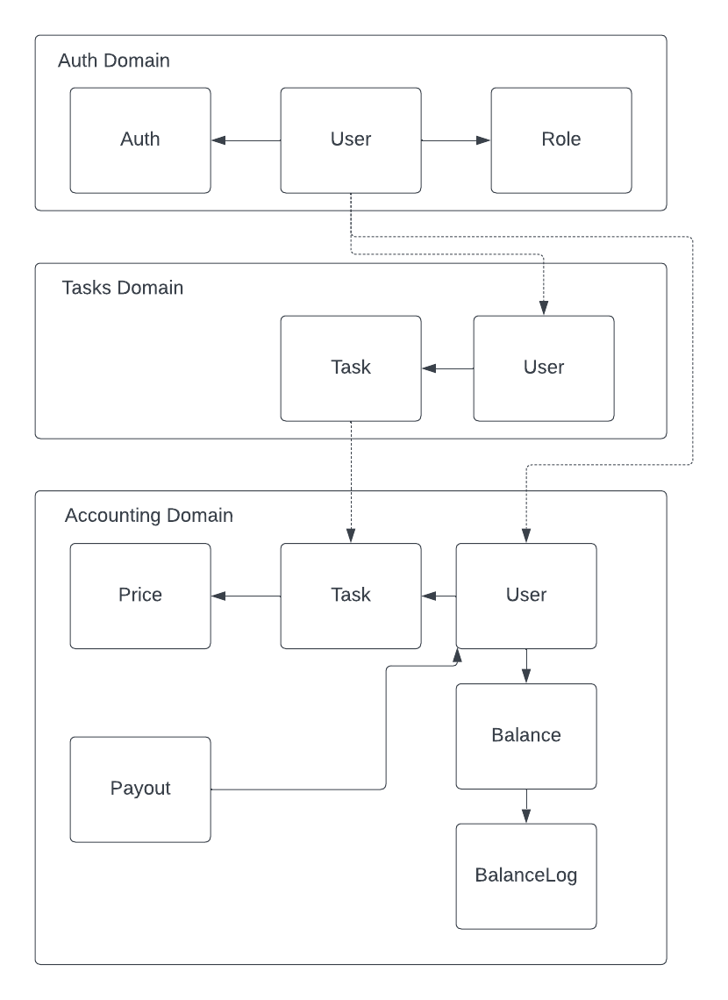

# Команды 

## Таск менеджер

Авторизоваться
Actor: User
Command: Login
Data: User
Event: User.Logined

Доступ к таскам
Actor: User
Command: Get Tasks
Data: User + Role
Event: -

Создане тасков
Actor: User
Command Create Task
Data: Task, User
Event: Tasks.Created + Tasks.AssigneeChanged

Заасайнить таски
Actor: User  Manager or Admin
Command: Assign Tasks
Data: Task, User
Event: Tasks.AssigneeChanged

Закрыть таску
Actor: User
Command: Close Task
Data: Task, User
Event: Tasks.StatusChanged

## Аккаунтинг

Доступ к аккаунтингу
Actor: User
Command: List BalanceLog, Balance
Data: User + Role
Event: -

Создание баланса
Actor: User.Created
Command: Create Balance
Data: User, Balance
Event: -

Установить цену на таску
Actor: Tasks.Created
Command: Set price for task
Data: Task
Event: Tasks.PriceSet

Списать с баланса
Actor: Tasks.AssigneeChanged
Command: Decrease the balance and write log
Data: Task, Balance, BalanceLogs
Event: -

Начислить на баланс
Actor: Tasks.Closed
Command: Increase the balance and write log
Data: Task, Balance, BalanceLogs
Event: -

Выплатить деньги
Actor: Cron
Command: Payout
Data:  Balance, Auditlog
Event: Payout.Created

Количество заработанных топ-менеджментом за сегодня денег
Actor: User role manager or admin
Command: Earned today
Data: Task
Event: -

## Аналитика

Самая дорогая таска
Actor: Task.Close
Command: Compare and set if price greather for today tasks
Data: Task
Event: -

Количество заработанных топ-менеджментом за сегодня денег
Actor: User role manager or admin
Command: Earned today
Data: Task
Event: -

Cколько попугов ушло в минус
Actor: User role manager or admin
Command: Count balances with minus value
Data: Balance
Event: -

## Коммуникации 

Синхронные:
* Таски, Аккаунтинг, Аналитика -> Сервис Авторизации

Ассинхронные:
* CUD события для Юзеров 
* CUD события для Тасков
* BE при смены исполнителя задачи
* BE при закрытии задачи
* CUD события для Баланса Юзеров
* BE при выплате

# Модель данных

